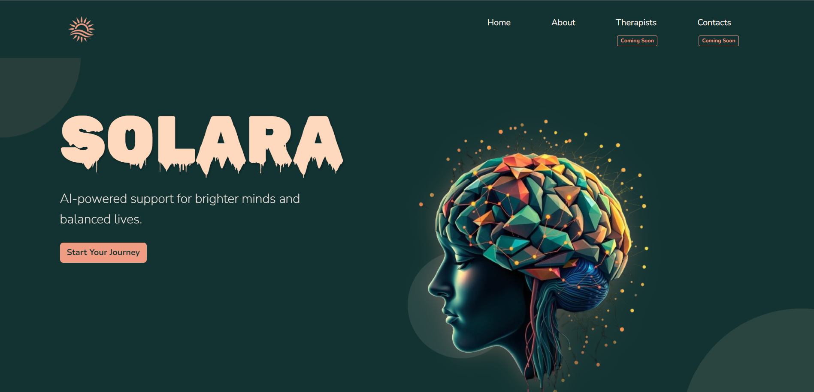
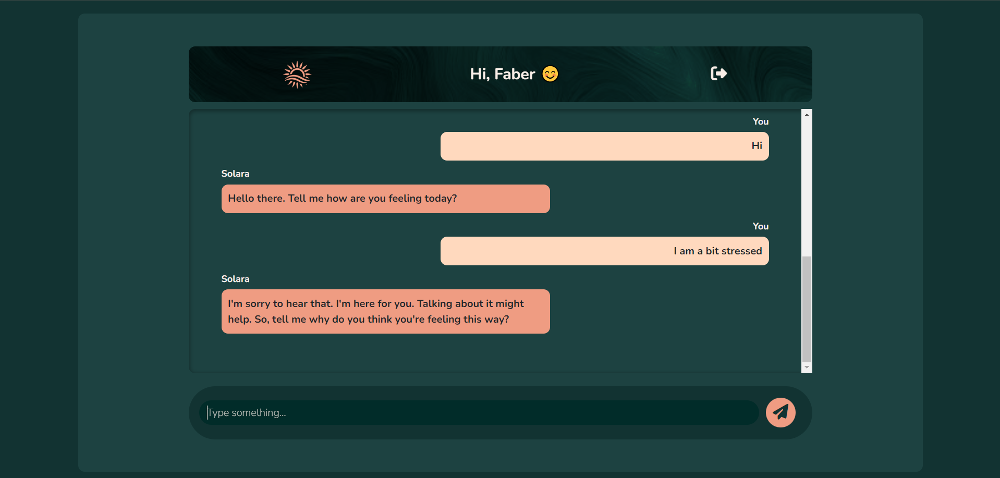

# Solara AI Mental Health Chatbot

## Table of Contents
- [Project Overview](#project-overview)
- [Features](#features)
- [Technology Stack](#technology-stack)
- [Setup Instructions](#setup-instructions)
  - [1. Clone the Repository](#1-clone-the-repository)
  - [2. Create a Virtual Environment](#2-create-a-virtual-environment)
  - [3. Install Dependencies](#3-install-dependencies)
  - [4. Set Up Environment Variables](#4-set-up-environment-variables)
  - [5. Migrate the Database](#5-migrate-the-database)
  - [6. Run the Development Server](#6-run-the-development-server)
- [Usage](#usage)
- [User Interface Design](#user-interface-design)
- [Contributing](#contributing)
- [License](#license)

## Project Overview

Solara AI is a conversational mental health chatbot built using Django, LangChain, and OpenAI. The chatbot is designed to offer a supportive and empathetic environment for students dealing with mental health issues. The chatbot leverages natural language processing and AI to respond intelligently to user input and simulate helpful conversations.

## Features
- **User Authentication**: Register, login, and logout functionality using Django's built-in authentication.
- **Interactive Chatbot**: A friendly, empathetic AI mental health therapist that can converse with users.
- **Dynamic Responses**: AI-powered responses generated using OpenAI's GPT models integrated with LangChain.
- **Secure API Key Management**: Environment variables are used to securely store sensitive information, like the OpenAI API key.

## Technology Stack

- **Backend**: Django, Python
- **Frontend**: HTML, CSS, Bootstrap, JavaScript
- **AI Integration**: LangChain, OpenAI GPT models
- **Database**: SQLite (default Django database, but can be configured for PostgreSQL or other databases)

## Setup Instructions

### 1. Clone the Repository

```bash
git clone https://github.com/WambiruL/solara_ai.git
cd solara_ai
```

### 2. Create a Virtual Environment

```bash
python -m venv myEnv
```

Activate the virtual environment:

- On macOS/Linux:

  ```bash
  source venv/bin/activate
  ```

- On Windows:

  ```bash
  venv\Scripts\activate
  ```

### 3. Install Dependencies

Install all the required Python packages using `pip`:

```bash
pip install -r requirements.txt
```

### 4. Set Up Environment Variables

Create a `.env` file in the root of your project to store your environment variables, specifically the OpenAI API key:

```
OPENAI_API_KEY=your_openai_api_key_here
```

### 5. Migrate the Database

Run the following command to apply database migrations:

```bash
python manage.py migrate
```

### 6. Run the Development Server

Start the development server using:

```bash
python manage.py runserver
```

Open your browser and go to `http://127.0.0.1:8000/` to see the application running.

## Usage

1. **Register**: Create an account on the application using the registration form.
2. **Login**: After registering, log in to access the chatbot.
3. **Start Chatting**: Engage with the chatbot by typing your messages into the chatbox. The bot will respond with AI-powered responses to help guide you through your issues.

## User Interface Design

#### Landing Page


#### Sign In


#### Solara Bot


## Contributing

Contributions to Solara AI are welcome! If you would like to improve the project, please fork the repository and create a pull request with detailed information about your changes.

## License

This project is licensed under the MIT License. You are free to modify, distribute, and use this project under the terms of the license.

#### Author : WambiruL


