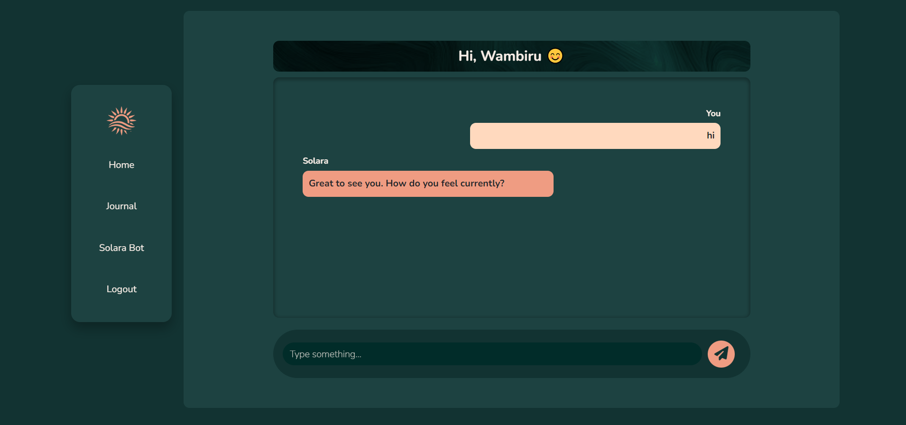

# Solara AI Mental Health Chatbot

## Table of Contents
- [Project Overview](#project-overview)
- [Features](#features)
- [Technology Stack](#technology-stack)
- [Setup Instructions](#setup-instructions)
  - [1. Clone the Repository](#1-clone-the-repository)
  - [2. Create a Virtual Environment](#2-create-a-virtual-environment)
  - [3. Install Dependencies](#3-install-dependencies)
  - [4. Migrate the Database](#5-migrate-the-database)
  - [5. Run the Development Server](#6-run-the-development-server)
- [Usage](#usage)
- [User Interface Design](#user-interface-design)
- [Contributing](#contributing)
- [License](#license)

## Project Overview

**Solara** is a mental health support platform built with Django, designed to provide students with a safe and empathetic space to manage and improve their mental well-being. Through personalized journaling, real-time insights, and an interactive AI therapist, Solara helps users navigate emotional challenges with support tailored to their unique needs.

## Features
- **User Authentication**: Secure registration, login, and logout using Django's built-in authentication.

- **Interactive Chatbot**: Solara, an empathetic AI mental health therapist, provides conversational support to help users manage their mental well-being.

- **Journal**: Users can create, view, and manage personal journal entries to track their thoughts and emotions over time.

- **Recommendations**: Personalized resource suggestions based on the sentiment analysis of journal entries, offering tailored content to support mental health.

- **Data Visualization**: Interactive graphs displaying mood trends based on journal entries, helping users gain insights into their emotional patterns throughout the week.

## Technology Stack
- **Django**: A robust web framework for server-side logic.

- **Python**: The primary programming language utilized for development.
- **HTML, CSS, Bootstrap**: Technologies for structuring and styling the user interface.
- **Mental Health JSON Files**: Custom datasets providing responses for the chatbot.

- **JavaScript**: Enhances interactivity throughout the platform.
- **SQLite**: The default database for data storage in Django.
- **SpaCy**: Utilized for natural language processing in the conversational AI.
- **Plotly**: A powerful tool for creating interactive charts to visualize sentiment trends.
- **Pandas**: Used for data manipulation and preparation for visualizations.
- **TextBlob**: Analyzes sentiment to track mood changes.

## Setup Instructions

### 1. Clone the Repository

```bash
git clone https://github.com/WambiruL/solara_ai.git
cd solara_ai
```

### 2. Create a Virtual Environment

```bash
python -m venv myEnv
```

Activate the virtual environment:

- On macOS/Linux:

  ```bash
  source virtualEnv/bin/activate
  ```

- On Windows:

  ```bash
  virtualEnv\Scripts\activate
  ```

### 3. Install Dependencies

Install all the required Python packages using `pip`:

```bash
pip install -r requirements.txt
```

### 5. Migrate the Database

Run the following command to apply database migrations:

```bash
python manage.py migrate
```

### 6. Run the Development Server

Start the development server using:

```bash
python manage.py runserver
```

Open your browser and go to `http://127.0.0.1:8000/` to see the application running.

## Usage

1. **Register**: Sign up for an account using the registration form to create your profile.
2. **Login**: After successful registration, log in to your account to access all features of the application.
3. **Explore Journal**: Navigate to the journal section to create, view, and manage your entries.
4. **Chat with Solara**: Engage with the AI mental health therapist by typing your messages in the chatbox. The chatbot provides empathetic responses to support your mental health journey.
5. **Receive Recommendations**: After journaling, you can view personalized resource recommendations based on your entries.
6. **Visualize Emotions**: Access emotion graphs to track your sentiments over time and gain insights into your mental well-being.

## User Interface Design

#### Landing Page


#### Sign In


#### Solara Bot


#### Journal


#### Resources recommendation


#### Data Visualization


## Contributing

Contributions to Solara AI are welcome! If you would like to improve the project, please fork the repository and create a pull request with detailed information about your changes.

## License

This project is licensed under the MIT License. You are free to modify, distribute, and use this project under the terms of the license.

#### Author : WambiruL


